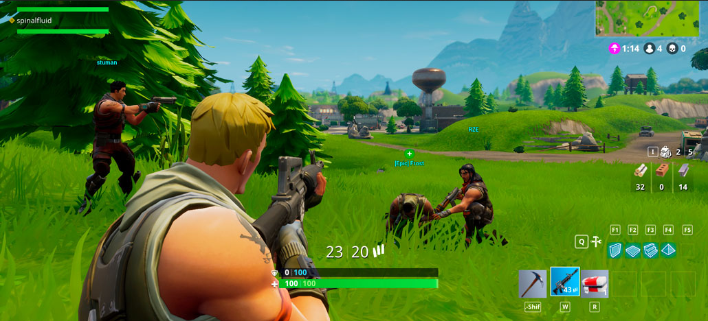
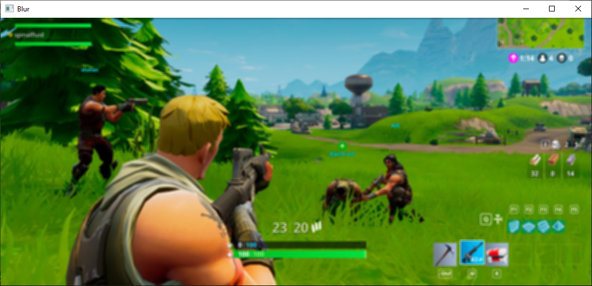

<h1 align="center">💻 Blur em Imagens - Python 💻</h1>

<br/>

## ✨Pré-requisitos

Antes de começar, você vai precisar ter instalado em sua máquina o
[Python 3.9.12](https://www.python.org/downloads/).
Após a instalação deste software, abra o local onde foi instalado e acesse a pasta Scripts.<br/>
Copie o diretório da pasta Scripts.<br/>
Abra o cmd do windows e digite `cd diretório_copiado`<br/>
Agora digite os seguintes comando e aguarde a finalização.<br/>
`pip install numpy`<br/>
`pip install opencv-python`<br/>
Após ter feito estes passos é só abrir o código no VS Code e ele estará pronto para uso

<br/>

---

## 📝 Sobre o Projeto
Este projeto tem como finalidade pegar uma imagem e fazer aplicação do filtro de suavização Blur, que deixa a imagem com um aspecto de borrado/desfoque

<br/>

---

## 🐱‍💻 Sobre o Código 

<br/>

```Py
import cv2
import numpy as np

img = cv2.imread('Blur/fortnite.png')
rows,cols=img.shape[:2]
intensidade_x = 25
intensidade_y = 25

kernel_25 = np.ones((intensidade_x,intensidade_y),np.float32)/625.0
output_kernel=cv2.filter2D(img,-1,kernel_25)

img_blur = cv2.blur(img,(10,10)) #Define o valor do efeito blur nas coordenadas (x,y)

cv2.imshow('Original',img)
cv2.imshow('Blur',img_blur)

cv2.waitKey(0)
```

## 🤓 Resultados
*Imagem Original* <br/>


*Imagem Blur* <br/>


