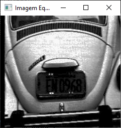

<h1 align="center">💻 Histograma e Equalização de Imagens - Python 💻</h1>

<br/>

## ✨Pré-requisitos

Antes de começar, você vai precisar ter instalado em sua máquina o
[Python 3.9.12](https://www.python.org/downloads/).
Após a instalação deste software, abra o local onde foi instalado e acesse a pasta Scripts.<br/>
Copie o diretório da pasta Scripts.<br/>
Abra o cmd do windows e digite `cd diretório_copiado`<br/>
Agora digite os seguintes comando e aguarde a finalização.<br/>
`pip install matplotlib`<br/>
`pip install opencv-python`<br/>
Após ter feito estes passos é só abrir o código no VS Code e ele estará pronto para uso

<br/>

---

## 📝 Sobre o Projeto
Este projeto tem como finalidade pegar uma imagem e fazer sua equalização, logo após será gerado o histograma da imagem original e a equalizada. Testado apenas com imagens na escada de cinza (intervalo branco(255) ao preto(0))

<br/>

---

## 🐱‍💻 Sobre o Código 

<br/>

```Py
from matplotlib import pyplot as plt
import cv2


img = cv2.imread('Equalizador_Histogramas/mulher.png')
#Converte a imagem para escala de cinza
img = cv2.cvtColor(img, cv2.COLOR_BGR2GRAY)
#Faz a equalização da imagem
img_eq = cv2.equalizeHist(img)

#Mostra a Imagem Original
cv2.imshow('Imagem Original',img) 
#Mostra a Imagem Equalizada
cv2.imshow('Imagem Equalizada',img_eq)

### Histograma da Imagem Equalizada ###
plt.figure(figsize=[6.4, 4.8])
#Configurações gráficas do histrograma
plt.title("Histograma Equalizado")
plt.xlabel("Intensidade")
plt.ylabel("Qtde de Pixels")
#Cria o Histograma da imagem equalizada
plt.hist(img_eq.ravel(), 256, [0,256]) 
plt.xlim([0, 256])
#Mostra o Histograma que foi criado (equalizado)
plt.show(block=False)

## Histograma da Imagem Original ##
plt.figure(figsize=[6.4, 4.8])
#Configurações gráficas do histrograma
plt.title("Histograma Original")
plt.xlabel("Intensidade")
plt.ylabel("Qtde de Pixels")
#Cria o Histograma da imagem original
plt.hist(img.ravel(), 256, [0,256])
plt.xlim([0, 256])
#Mostra o Histograma que foi criado (original)
plt.show(block=True)

cv2.waitKey(0)
```

## 🤓 Resultados
*Imagem Original do Fusca* <br/>


*Histograma Imagem Original do Fusca* <br/>


*Imagem Equalizada do Fusca*<br/>


*Histograma Imagem equalizada do Fusca*<br/>


---
*Imagem Original da Mulher*<br/>


*Histograma da imagem Original da Mulher*<br/>


*Imagem Equalizada da Mulher*<br/>


*Histogramada da imagem Equalizada da Mulher*<br/>
